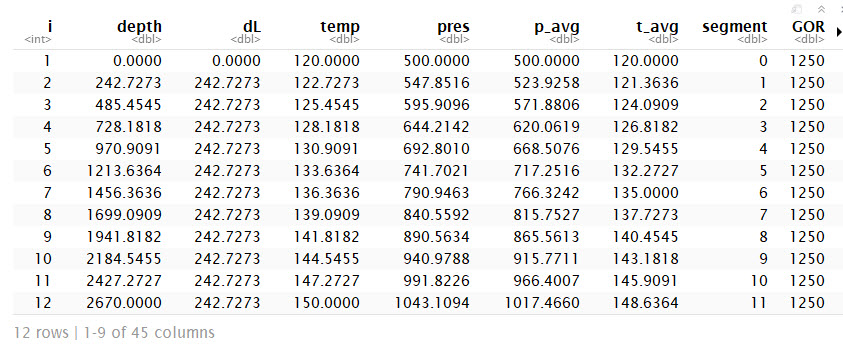

<!-- README.md is generated from README.Rmd. Please edit that file -->

[](https://travis-ci.org/f0nzie/rNodal)
[](https://codecov.io/gh/f0nzie/rNodal)

# rNodal

The goal of rNodal is to provide nodal analysis for oil and gas wells.

## Installation

You can install rNodal from github with:

``` r
# install.packages("devtools")
devtools::install_github("f0nzie/rNodal")
```

## Example

This is a basic example which shows you how to solve a common problem:

``` r
## basic example code
```

## Using `zFactor`

`zFactor` is a R package. Calling from CRAN.

We will use zFactor for gas compressibility calculations.

``` r
# use the new library zFactor
library(zFactor)

z.HallYarborough(pres.pr = 4.5, temp.pr = 1.4)
#> [1] 0.7373812
z.DranchukAbuKassem(pres.pr = 4.5, temp.pr = 1.4)
#> [1] 0.7396345
z.BeggsBrill(pres.pr = 4.5, temp.pr = 1.4)
#> [1] 0.7343367
z.Ann10(pres.pr = 4.5, temp.pr = 1.4)
#> [1] 0.736032
z.Papp(pres.pr = 4.5, temp.pr = 1.4)
#> [1] 0.7299354
```

## How rNodal works

Start by looking at the examples in the vignettes. We will use in this
example `VLP Brown - Example C13`.

This is example C.13 in the Kermit Brown book.

### Input well data

We enter the well data with the function `setWellInput`:

``` 
input.example.C13 <- setWellInput(field.name = "HAGBR.MOD",
                                    well.name = "Brown_C13", 
                                    depth.wh = 0, depth.bh = 2670, 
                                    diam.in = 1.995, 
                                    GLR = 500, liq.rt = 1000, wcut = 0.6, 
                                    thp = 500, tht = 120, bht = 150, 
                                    API = 22, gas.sg = 0.65, 
                                    wat.sg = 1.07, if.tens = 30)
                                    
                                    
```

The field name and well name are used for archival purposes.

### Enter the parameters of the VLP model

The parameters of the model consist of:

`vlp.model`: the correlation or mechanistical model

`segments`: the number of segments to split the well

`tol`: the tolerance of the delta-P iterations

``` 
well.model <- setVLPmodel(vlp.model = "hagbr.mod", 
                           segments = 11, 
                                tol = 0.000001)
                                
                                
                                
```

### Run the model

To run the model is necessary to provide:

`well.input`: all the well parameters as entered in the first step

`well.model`: the VLP model as entered in the second step

    runVLP(well.input = input.example.C13, well.model))

### Results

The results are given in the form of a dataframe where the rows
represent the number of segment plus one and the columns are the
calculations or variables.


