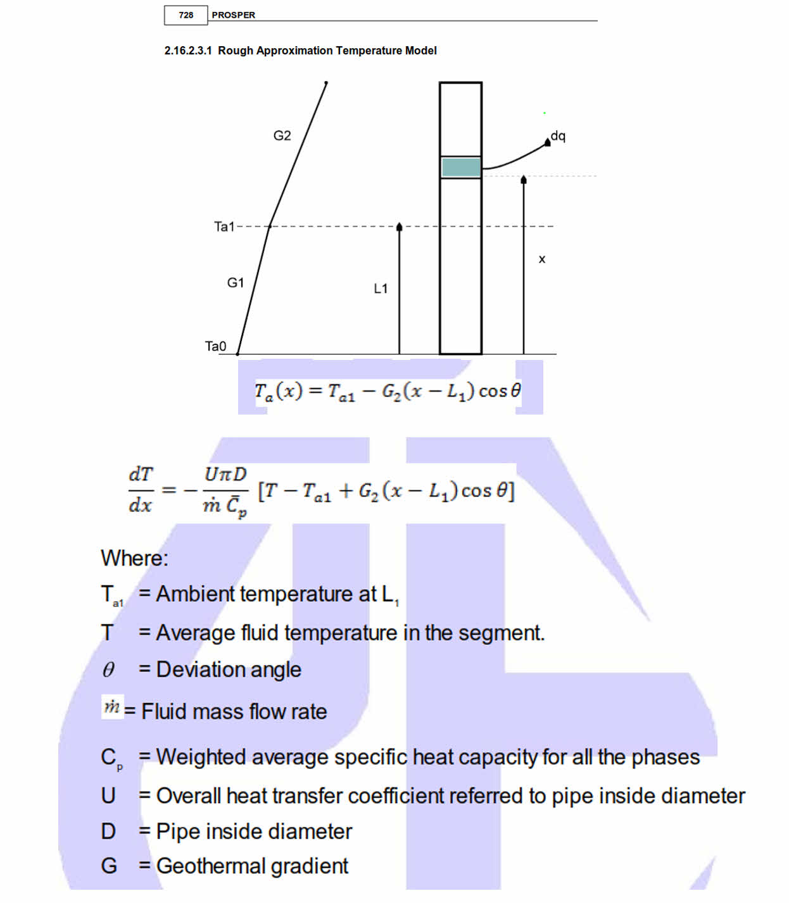
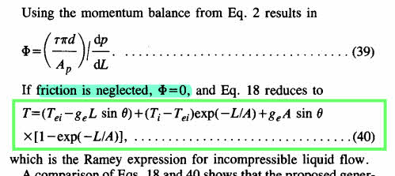

```{r setup, include = FALSE, error=TRUE, message=FALSE, warning=FALSE}
knitr::opts_chunk$set(echo = TRUE, 
                      comment = "#>",
                      collapse = TRUE,
                      error = TRUE,
                      warning = FALSE,
                      message = FALSE,
                      fig.align = 'center'
                      )
```


# Guo P44 data as text with depth, dL, pres and temp

> Where is this data coming from? Guo_P44

```{r rows.print=30}
library(tibble)

well <- "
depth	dL	pres	temp
0	      0	200	    80.0
334	    334	267	    83.4
669	    334	339	    86.9
1003	334	415	    90.3
1338	334	495	    93.8
1672	334	580	    97.2
2007	334	667	    100.7
2341	334	756	    104.1
2676	334	849	    107.6
3010	334	944	    111.0
3345	334	1042	114.5
3679	334	1141	117.9
4014	334	1242	121.4
4348	334	1344	124.8
4683	334	1449	128.3
5017	334	1554	131.7
5352	334	1661	135.2
5686	334	1769	138.6
6021	334	1878	142.1
6355	334	1988	145.5
6690	334	2099	149.0
7024	334	2210	152.4
7359	334	2323	155.9
7693	334	2436	159.3
8028	334	2549	162.8
8362	334	2664	166.2
8697	334	2778	169.7
9031	334	2894	173.1
9366	334	3009	176.6
9700	334	3125	180.0
"

# read string text to dataframe
well_table <- read.table(header = TRUE, text = well)
as_tibble(well_table)
```


# Fluid temperature calculation using old `temp.fluid` function

```{r rows.print=30}
# parameters necessary to calculate the fluid temperature
theta   <-  pi /2
diam.in <- 1.995
diam.ft <- diam.in / 12
tht     <- 80
bht     <- 200
depth   <- 9700
ge      <- (bht - tht) / depth
# m <- mass.rate <- 228145
m <- mass.rate <- 239562.2276
U <-  2
# U <- 4
cp.avg <- (0.53 + 0.5 + 1 ) / 3

# calculate dT/dx for the well
rNodal:::temp.fluid(well_table, theta, depth, bht, tht, U, cp.avg, diam.ft, mass.rate)
```


## Fluid temperature equation in Prosper manual

<div style="width:400px; height=400px">

</div>
    

```{r rows.print=30}
# using Prosper equation
# there is a problem in this algorithm. It should start at the bottom not at the surface.
U = 8
Cp <- (0.53 + 0.5 + 1 ) / 3
k <- U * pi * diam.ft / m / Cp
Ti <- bht

for (i in nrow(well_table):1) {
    L  <- depth - well_table[i, "depth"]
    dL <- well_table[i, "dL"]
    Tei <- well_table[i, "temp"]
    dT.dx <- k * (Ti - Tei + ge * L * sin(theta))
    Ti <- Ti - dT.dx * dL

    # cat(sprintf("%3d %10.0f %10.2f %12.6f %12.3f \n", i, L, Tei, dT.dx, Ti))
    well_table[i, "L"]  <- L
    well_table[i, "dT.dx"]  <- dT.dx
    well_table[i, "Ti"] <- Ti
}
print(well_table)

library(ggplot2)

ggplot(well_table, aes(x = Ti, y = depth)) +
    geom_point() + scale_y_continuous(trans = "reverse") +
    scale_x_continuous(lim = c(0, 200))

```


## Ramey's derivation from Alves equation
    

```{r, out.width = "500px", out.height="500px", echo=FALSE}

```

```{r rows.print=30}
# using Ramey's equation
U <- 4
Cp <- (0.53 + 0.5 + 1) / 3
k <- U * pi * diam.ft / m / Cp
A <- 1 / k                      # relaxation distance by Ramey. Shoham, pg 297

cat(U, Cp, diam.ft, m, k, A, "\n")

Ti <- bht
for (i in nrow(well_table):1) {
    L <- depth - well_table[i, "depth"]
    Tei <- well_table[i, "temp"]
    
    Ti <- (Tei - ge * L * sin(theta)) +
          (Ti - Tei) * exp(-L/A) +
        ge * A * sin(theta) * (1 - exp(-L/A))
    
    # cat(sprintf("%3d %10.0f %10.2f \n", i, L, Ti))
    well_table[i, "L"]  <- L
    well_table[i, "Ti"] <- Ti
}
print(well_table)

library(ggplot2)

ggplot(well_table, aes(x = Ti, y = depth)) +
    geom_point() + scale_y_continuous(trans = "reverse") +
    scale_x_continuous(lim = c(0, 200))
```


```{r}
# From Ramey's paper
0.0083 * 6000 + 70 - 0.0083 * 30400 + (58.5 + 0.0083*30400 - 70) * exp(-6000/30400)
```

```{r}
0.0083 * 6000 + 70
```


```{r}
# the fluid temperature function
# desnding in a water injector
fT <- function(Ti, Te0, geo_grad.nz, L, theta.nz, A) {
  Tei = geo_grad.nz * L + Te0
  
  (Tei - geo_grad.nz * L * sin(theta.nz)) +
    (Ti - Tei) * exp(-L/A) +
    geo_grad.nz * A * sin(theta.nz) * (1 - exp(-L/A))
}

# steps of 500 ft
# Ti: injection water temperature at the surface
# Te0: earth temperature at starting injection point
for (i in seq(0, 6000, 500))
  cat(i, fT(Ti = 58.5, Te0 = 70, 0.0083, L = i, pi/2, A = 30400), "\n")

# fT(Ti = 65.2, 120, 0.0083, -6000, pi/2, 30400)
#    0 58.5 
#  500 58.72135 
# 1000 59.00569 
# 1500 59.3509 
# 2000 59.75491 
# 2500 60.21572 
# 3000 60.73137 
# 3500 61.29994 
# 4000 61.91958 
# 4500 62.58846 
# 5000 63.30481 
# 5500 64.0669 
# 6000 64.87306 
```

```{r}
# fluid goes bottom up
# Te0: earth temperature at starting point
fT <- function(Ti, Te0, geo_grad.nz, L, theta.nz, A) {
  Tei = geo_grad.nz * L + Te0
  
  (Tei - geo_grad.nz * L * sin(theta.nz)) +
    (Ti - Tei) * exp(-L/A) +
    geo_grad.nz * A * sin(theta.nz) * (1 - exp(-L/A))
}
```

```{r}
# calculate Ti at the bottom of the well
# Guo's data
# constants
diam.in <- 1.995
diam.ft <- diam.in / 12
U <- 4
Cp <- (0.53 + 0.5 + 1) / 3
m <- mass.rate <- 239562.2276
grad <- (tail(well_table$temp, 1) - head(well_table$temp, 1)) / (tail(well_table$depth, 1) - head(well_table$depth, 1))

Ti  <- tail(well_table$temp, 1)
Te0 <- tail(well_table$temp, 1)
depth = tail(well_table$depth, 1)

k <- U * pi * diam.ft / m / Cp
A <- 1 / k                      # relaxation distance by Ramey. Shoham, pg 297

cat(Ti, Te0, depth, "\n")
cat(grad, U, Cp, diam.ft, m, k, A, "\n")
```

## Ascending with arbitrary step. Guo's data

```{r}
# production well
# using Guo's data
# interval every 100 ft
for (i in seq(0, -depth, -100))
  cat(sprintf("%8.0f %8.0f %10.3f \n",
    depth+i, i, fT(Ti = Ti, Te0 = Te0, grad, i, pi/2, A)))
# 9700        0    180.000 
# 9600     -100    180.001 
# 9500     -200    180.003 
# 9400     -300    180.006 
# 9300     -400    180.011 
# 9200     -500    180.017 
# 9100     -600    180.024 
# 9000     -700    180.033 

# 500    -9200    186.088 
# 400    -9300    186.226 
# 300    -9400    186.366 
# 200    -9500    186.508 
# 100    -9600    186.652 
#   0    -9700    186.797 
```

## Ascending with `well_table`. Guo's data

```{r}
# ascending in the well. Guo's data.
# the starting temperature Te0 is BHT
# using well_table
# providing a negative sign for the iterating depth
# if we are injecting, remove the minus sign 
for (i in well_table$depth) {
  # cat(i, "\n")
  cat(sprintf("%8.0f %8.0f %10.3f \n",
    depth-i, i, fT(Ti = Ti, Te0 = Te0, grad, -i, pi/2, A)))
}

    # 9700        0    180.000 
    # 9366      334    180.007 
    # 9031      669    180.030 
    # 8697     1003    180.067 
    # 8362     1338    180.120 
    # 8028     1672    180.188 
    # 7693     2007    180.272 
    # 7359     2341    180.371 
    # 7024     2676    180.487 
    # 6690     3010    180.618 
    # 6355     3345    180.765 
    # 6021     3679    180.928 
    # 5686     4014    181.108 
    # 5352     4348    181.304 
    # 5017     4683    181.517 
    # 4683     5017    181.746 
    # 4348     5352    181.993 
    # 4014     5686    182.256 
    # 3679     6021    182.537 
    # 3345     6355    182.834 
    # 3010     6690    183.150 
    # 2676     7024    183.482 
    # 2341     7359    183.833 
    # 2007     7693    184.201 
    # 1672     8028    184.589 
    # 1338     8362    184.993 
    # 1003     8697    185.416 
    #  669     9031    185.857 
    #  334     9366    186.318 
    #    0     9700    186.797 
```

# Example from Ramey's paper

## Find temperature at the bottom knowing Tf at the surface
```{r}
fT1 <- function(geo_grad.nz, L, temp_surf, A, Tf0) {
  geo_grad.nz * L + temp_surf - geo_grad.nz * A +
  (Tf0 + geo_grad.nz * A - temp_surf) * exp(-L/A)
}

fT1(0.0083, 6000, 70, 30400, 58.5)

```

## iterating from surface to bottom at `step=500`

```{r}
# injection well. Starting with a fluid temperature of 58.5 degF
for (i in seq(0, 6000, 500)) {
  tf <- fT1(0.0083, i, 70, 30400, 58.5)
  cat(i, tf, "\n")
}
```

# Find Tf at the surface knowing Tf.bh and Te.bh

## Ramey's equation from paper

$$T_1 = aZ + b -aA + (T_0 + aA - b) \; e^{-Z/A}$$

```{r}
# Ramey's equation from paper
fTbh <- function(Tf0, Te0, geo_grad.nz, L, A) {
  (geo_grad.nz * L + Te0 - geo_grad.nz * A) +
  (Tf0 + geo_grad.nz * A - Te0) * exp(-L/A)
}

# production well. 
# Starting with a fluid temperature of 65.2 degF
# change the sign of L because we are ascending (production)
depth.wh <- 0
depth.bh <- 6000
depths <- seq(depth.wh, depth.bh, 500)

for (i in depths) {
  tf <- fTbh(Tf0 = 65.2, Te0=120, 0.0083, -i, 30400)
  cat(sprintf("%8.0f %8.0f %8.3f \n", depth.bh-i, -i, tf))
}
```
